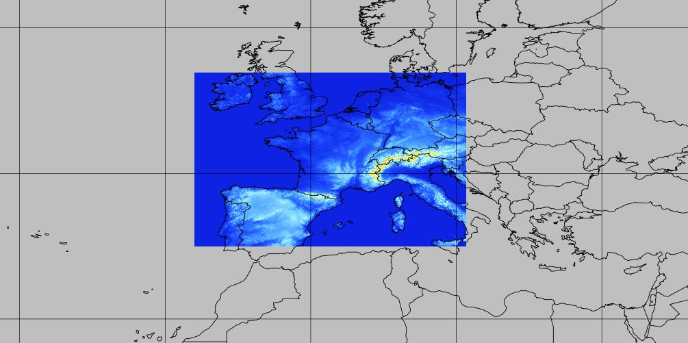

# arome-france-hd

TODO: url to bucket

## Coverage
France + neighborhood at 0.01° (~1.5km) resolution

## Static files

TODO

## Timesteps

Hourly data

# Range

* Runs 00 & 12: up to 42h
* Runs 06 & 18: up to 36h

## Parameters

TODO

## V1 dataset packages

`00H06H`, `07H12H`, `13H18H`, `19H24H`, `25H30H`, `31H36H`, `37H42H`

`SP1`, `SP1`, `SP3`, `HP1`

## Notes

Météo-France provides very minimal data for this model.

There is altitude data only for 20, 50 and 100m AGL levels.
