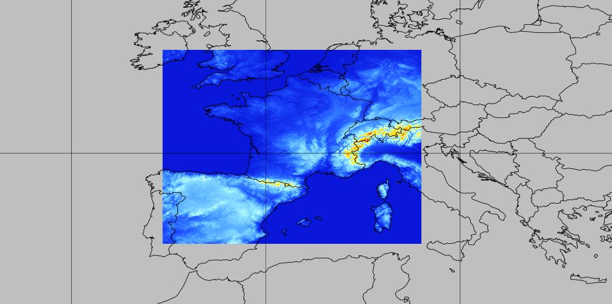

# arome-france

## 📂 [Browse arome-france dataset](/#arome-france/)

## Coverage

France + neighborhood at 0.025° (~2.5km) resolution

## Static files

* [Model terrain height](https://mf-nwp-models.s3.amazonaws.com/arome-france/static/terrain.grib2)
* [Landmask](https://mf-nwp-models.s3.amazonaws.com/arome-france/static/landmask.grib2)

## Timesteps

Hourly data

## Range

* Runs 00 & 12: up to 42h
* Runs 06 & 18: up to 36h

## Parameters

TODO

## V1 dataset packages

`00H06H`, `07H12H`, `13H18H`, `19H24H`, `25H30H`, `31H36H`, `37H42H`

`SP1`, `SP2`, `SP3`, `HP1`, `HP2`, `HP3`, `IP1`, `IP2`, `IP3`, `IP4`, `IP5`
