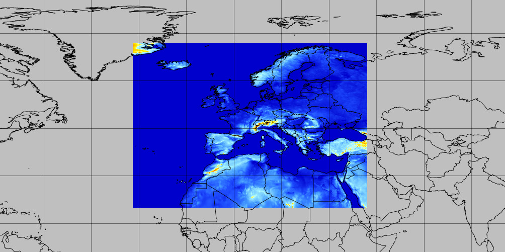

# arpege-europe

## 📂 [Browse arpege-europe dataset](/#arpege-europe/)

## Coverage
Europe at 0.1° (~11km) resolution

## Static files

* [Model terrain height](https://mf-nwp-models.s3.amazonaws.com/arpege-europe/static/terrain.grib2)
* [Landmask](https://mf-nwp-models.s3.amazonaws.com/arpege-europe/static/landmask.grib2)

## Timesteps

* 0h → 11h: hourly
* 12h → 72h: 3-hourly
* 72h → end: 6-hourly

## Range

* Run 00: up to 102h
* Run 06: up to 72h
* Run 12: up to 114h
* Run 18: up to 72h

## V1 dataset packages

`00H12H`, `13H24H`, `25H36H`, `37H48H`, `49H60H`, `61H72H`, `73H84H`, `85H96H`, `97H102H`, `103H114H`

`SP1`, `SP2`, `HP1`, `HP2`, `IP1`, `IP2`, `IP3`, `IP4`
