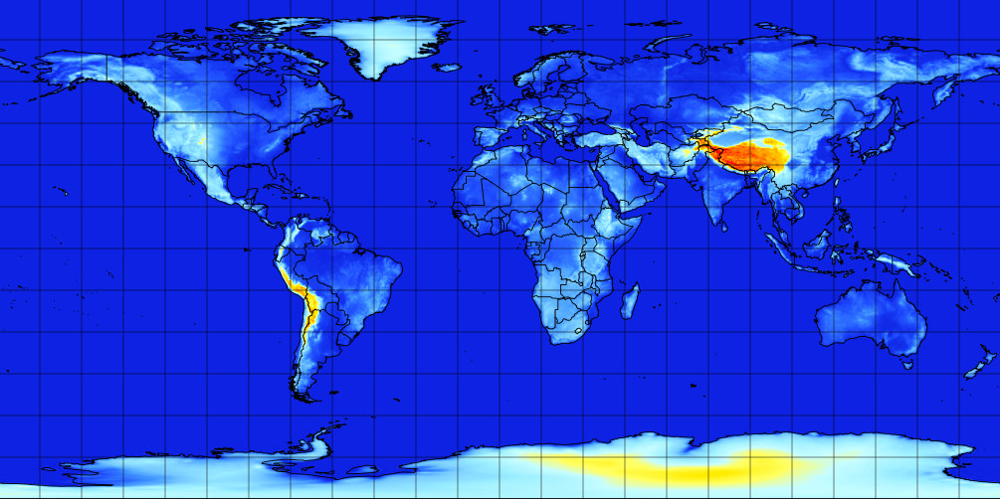

# arpege-world

## 📂 [Browse arpege-world dataset](/#arpege-world/)

## Coverage
Global at 0.5° (~55km) resolution

## Static files

* [Model terrain height](https://mf-nwp-models.s3.amazonaws.com/arpege-world/static/terrain.grib2)
* [Landmask](https://mf-nwp-models.s3.amazonaws.com/arpege-world/static/landmask.grib2)

## Timesteps

* 0h → 96h: 3-hourly
* 96h → end: 6-hourly

## Range

* Run 00: up to 102h
* Run 06: up to 72h
* Run 12: up to 114h
* Run 18: up to 72h

## V1 dataset packages

`00H24H`, `27H48H`, `51H72H`, `75H102H`, `105H114H`

`SP1`, `SP2`, `HP1`, `HP2`, `IP1`, `IP2`, `IP3`, `IP4`
